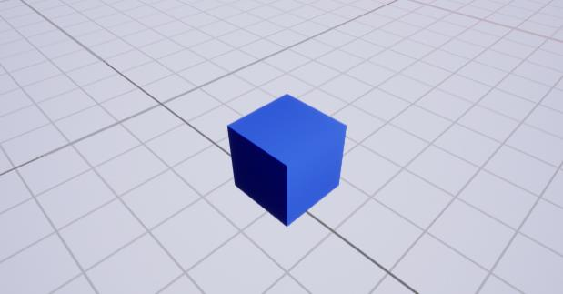

# XONIX
**2.5D арканоід для ОС Windows**

## Опис задачi
Сенс гри — захопити >= 75% поля. По полю хаотично бігають кульки. Швидкiсть кульок приблизно 20% ширини поля за 1 секунду (буде уточнюватися в процессi розробки). Якщо вони зіткнуться з лінією, яку гравець веде, або гравець зiткнеться зi своею ж лiнiею, - втрачаємо життя та становимося в позицiю з якої почалася гра теперiшньго рiвня(середина ближнього ребра поля). На початку гри даеться три життя. Нам треба захопити >= 75% поля для переходу на наступний рівень. На кожному наступному рiвнi кiлькiсть кульок збiльшуеться на одну та добавляеться одне життя до iснуючих. Коли кiлькiсть кульок зростає настiльки, що вони займають 10% грального поля, — то гра вважаеться пройдена i гравцю виводеться на екран повiдомлення про перемогу. Пiсля повiдомлення про перемогу при натисканнi будь якої клавiшi йде перехiд до меню(варiанти меню: "Нова гра", "Вихiд"). На першому рiвнi присутня одна кулька. Внизу екрана показана ігрова статистика: набраний відсоток захопленого поля, життя гравця. Поле займає максимальну можливу область екрана у спiввiдношеннi ширини та висоти як 3:4.Кульки, обьект гравця(на початку у виглядi кульки, у подальшому буде замiщен на бiльш детальну модель) та бонуси мають розмiр приблизно 5% ширини поля(уточнюється в процессi розробки). Висота та ширина граничних стiнок дорiвнюють розмiру обьекту гравця.Звуковим супроводом виділяються втрата життя, успішне завершення рiвня, пiднiмання бонусiв (сердечко — дає життя, колючка — вiднiмає життя). Бонуси падають зверху на поле з частотою 1шт. за 15 секунд та крутяться навколо своєї оci. Швидкiсть падiння 20% ширини поля за секунду (буде уточнюватися в процессi розробки). Гравець буде рухатися стрiлками вверх, влiво, право, вниз. При русi по незахопленому полю за гравцем залишаеться лiнiя шириною 0,5 ширини объекта гравця. При вiдрiзаннi незахопленого поля лiнiею, менша площа перетворюеться на захоплену. Якщо ж у вiдciченiй областi поля є кулька, то малюється тiльки лiнiя.
Гравець буде рухатися стрiлками вверх, влiво, право, вниз. При русi по незахопленому полю за гравцем залишаеться лiнiя шириною 0,5 ширини объекта гравця. При вiдрiзаннi незахопленого поля лiнiею, менша площа перетворюеться на захоплену. Якщо ж у вiдciченiй областi поля є кулька, то малюється тiльки лiнiя.

## Постановка задачi
Шаги розробки программи:

        1) Розробити в 2d вимiрi алгоритми та логiку.
        2) Оптимiзувати алгоритми.
        3) Добавити z-координату на матрицi проекцiй для 3d вимiру.
        4) Тестування та налагодження програми. 

## Oбьекти на вiдношення мiж ними

### Гра

Гра — головний обьект, який включае в себе всi iншi.

### Звук

Звуком супроводжуеться пройдений рiвень, програш, або пiднiмання бонусiв

### Поле 

Поле  вiдповiдає за генерацiю ворожих шарiв спочатку гри або пiсля переходу на наступний рiвень,також вiдповiдае за спавн колючок при зiткненнi з якими вiднiмаеться життя та сердечок при зiткненнi з якими додаеться життя. Розрахунок колiзiй

### Колючка

Колючка: тривалiсть життя в довiльному дiапазонi (3 - 5) секунд. При зiткненнi вiднiмає життя гравцю.

### Cердечко

Cердечко: тривалiсть життя в довiльному дiапазонi (3 - 5) секунд. При зiткненнiє додає життя гравцю.

### Гравець

Гравець його подiї, спавн лiнiї при русi.

### Лiнiя

Лiнiя може вiдсiкти все поле або залишитися лише лiнiею при вдалому випадку (ворожа кулька не зiткнулася з лiнiею).

### Kулька 

Ворожа кулька заважає гравцю захопити поле. При зiткненнi з гравцем або лiнiею гравець втрачає життя та становиться в позицiю з якої почалася гра теперiшньго рiвня(середина ближнього ребра поля).

### Статистика

 Статистика - вiджет, який вiдображае вiдсоток захопленого поля та кiлькiсть залишившихся життiв на екран.

### Меню

Меню - вiджет, який вiдповiдае за вiдображення пунктiв меню(кнопок).

### Кнопка

Кнопка - UI елемент, на який можна клацнути, пункти меню.

**Як видно з аналiзу предметної областi головним об'єктом є гра (Game). Його пiдоб'єкти: Звук (Sound), Статистика (Statistics), Меню (Menu),  Поле (Field). Поле в свою чергу містить: Ворожa кулькa (Enemy Ball), Колючка (Prickle), Cердечко (Heart), Гравець (Player). Гравець містить: Лiнiя (Hatchery). Mеню мiстить: Кнопка (Button).**

**Графiчно це можна сприймати у виглядi такої моделi:**
 

## Дiаграма об'єктiв та класiв

Як видно з аналiзу предметної областi головним об'єктом є гра (Game). Гра мiстить поле(GameField) та статистуку(StatusPanel). Його поля: Ворожий шар(AEnemyBall), Колючка(APrickle), Сердечко(AHeart), Гравець(Player). Гравець містить: Штриховка(AHatch). AActor мiстить у собi загальну функцiональнiсть будь якого об'єкту, який можна заспавнити на рiвнi.

Графiчно це можна представити у виглядi такої моделi:
 

## Дiаграма послiдовностей

## Дiаграми станiв
 

 

## Вид классiв

## Математика

При спавнi(народженнi) на полi кульки, вона має випадковий вектор швидкостi( — випадкове,   — швидкiсть кульки).

При вiдбиваннi кульок вiд границь захопленого поля та iнших кульок кут змiнюеться на протилежний.

Загальний алгоритм перемiщення та колiзiй (зiткнень):

     1) Переміщається об'єкт, поки він не зустрічає перешкоду
     2) Находиться нормаль
     3) Змiнюються вектори швидкостей
     4) Вертаемося до п. 1

Нехай радiус кульок R(r1 = r0), координати кульок в точках p1(x1;x2) та p2(y1;y2) вiдповiдно, тодi:

### Прототип 2d

## Процесс гри

## Захист программи

